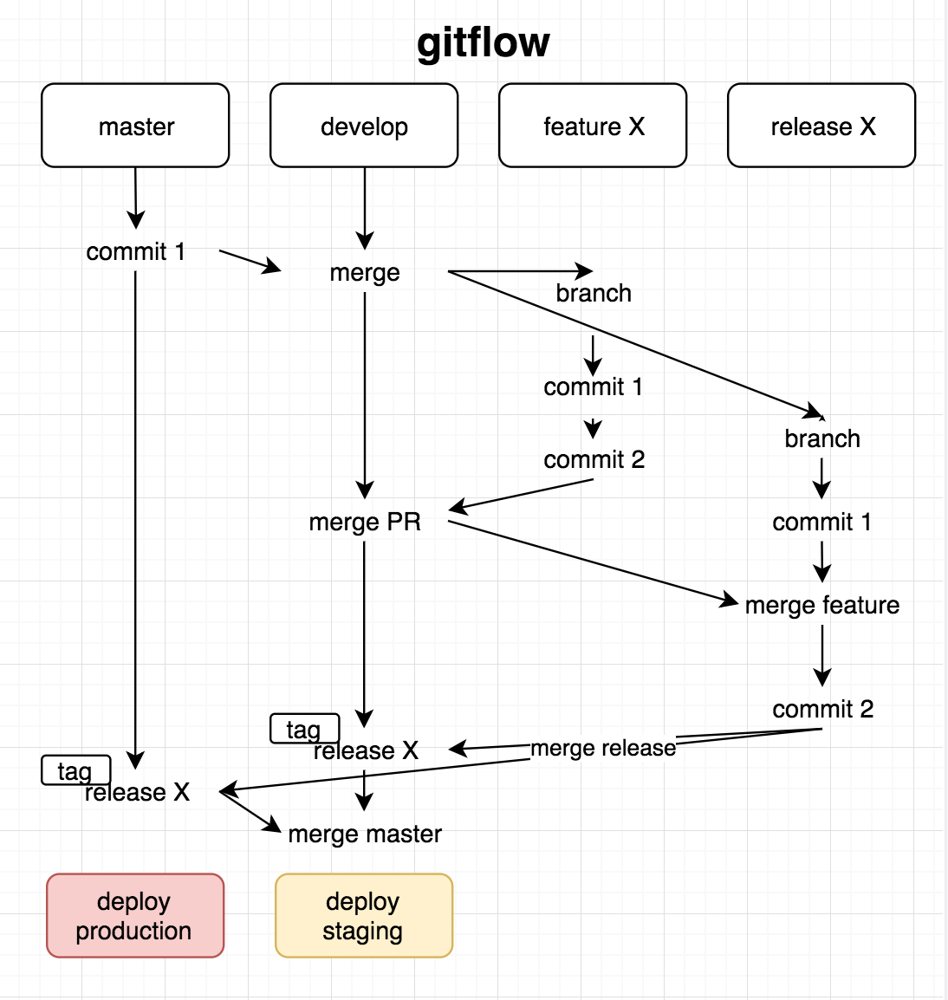

# Create issues
Use the code! Play with it, give us feedback. You can always create an issue to let us know what is wrong or you think 
needs to be changed.

# Solve issues
Pick an issue from github. Tell us that you're working on it, create a draft PR (so we can discuss if all is going in 
the right direction), finish off and make the PR.

# Join the team
Join the team!
* Slack: drpsychick.slack.com
* Email me

We're happy to have collaborators that give helpful feedback, contribute even it's only a little or enrich our 
discussions with interesting thoughts.

# How we work
## gitflow
We use gitflow. In essence similar to githubflow, but we branch off of `development` and merge first with `development` 
because that deploys the skill to "staging".

We optionally create tags on `development` if we see the need for a development release.




If you work on an issue (on your branch) and want to make it a pull request:
```bash
hub pull-request -i <issue-number> -b development -d # -d for draft-pr
```